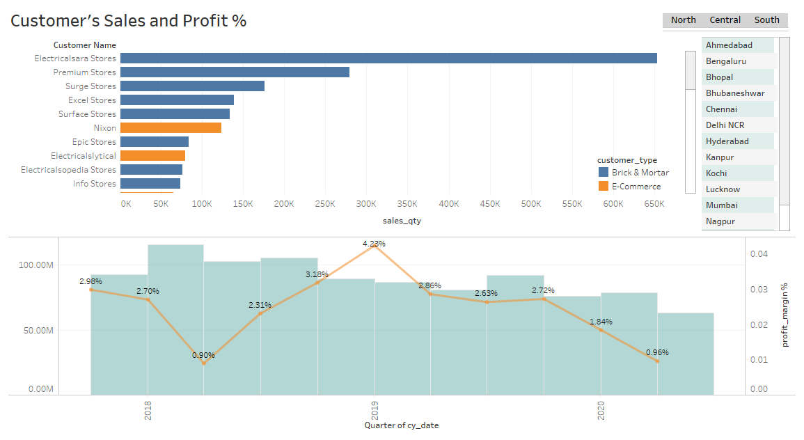
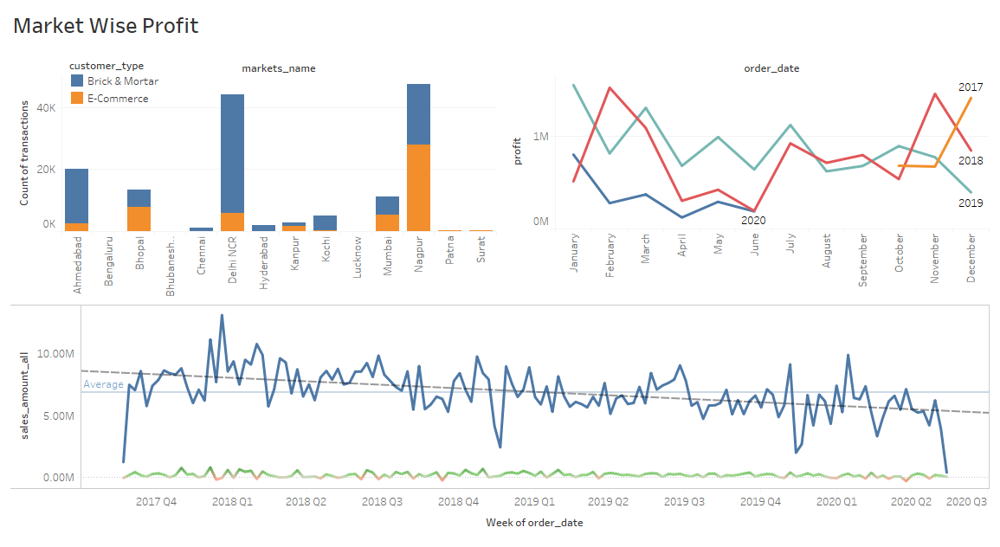

Created Two Dashboards using Atliq Hardware Sales data.
[Link to Tableau Public](https://public.tableau.com/profile/ranga.nadh#!/vizhome/new_16095169623670/MarketWiseProfit?publish=yes)

In the above dashboard we can observe region wise, city wise sales of every customer and their total sales , Profit margin percentage.

In the above dashboard we can observe market wise profit over past years and historic weeks data of total sales and profit-loss. 
