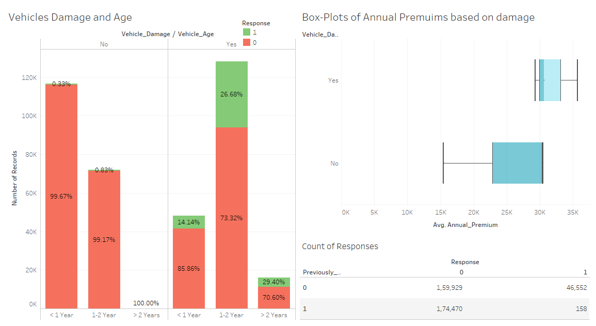

## Objective :                  
To build a model that Recommends the clients who purchase Vehicle Insurance with Health Insurance.

## Data :                   
Data is taken from [kaggle](https://www.kaggle.com/anmolkumar/health-insurance-cross-sell-prediction?select=train.csv).

## Work Done :
1. Pre-Process - Formatting columns.
2. Imbalanced data - Used SMOTENC to upsample the minor class.
3. EDA - Used Tableau to explore the data,[check here](https://public.tableau.com/profile/ranga.nadh#!/vizhome/Vehicle_Insurance/Dashboard3).
4. Feature Selection - Using SelectKBeast - mutual_info_classif.
5. Model Building :

| Model |Train ROC_AUC |Test ROC_AUC|
|------|------|------|
|LogisticRegression  | 0.84 | 0.83 |
|RandomForest Classifier | 0.99 | 0.99 |
|AdaBoost Classifier | 0.86 |0.84 |
|GradientBoost Classifier | 0.89 |0.84 |

## Dashboards:
### Region Wise Policy sales via channels and their Premiums.

.png)

##
### Response(Purchasing Policy) ratios based on Vehicle Age and Damage.

